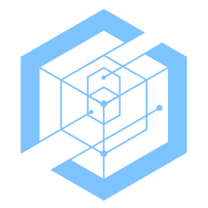

<p align="center">
<a target="_blank" href="https://kodexlabs.io/"></a>
</p>
<p align="center">
Sidecar on Dock
</p>
<p align="center">
<a href="https://github.com/kodexlabs-io/sidecar-on-dock/actions/workflows/ci.yml"></a>
</p>

A lightweight daemon that monitors a Thunderbolt dock (specified by a unique hardware identifier in a JSON configuration file) and automatically manages display extension. When the dock is connected, your display will extend to an iPad via Sidecar; when disconnected, the extension is removed.

> **Warning:** This project uses Apple's private `SidecarCore.framework`. Private APIs are undocumented, unsupported, and may break with any macOS update. Use at your own risk.

## Tested On

| Mac | Dock | iPad | macOS |
|---|---|---|---|
| MacBook Pro 14-inch (M4 Pro, 2024) | CalDigit TS3 Plus (Thunderbolt 3) | iPad Pro (M2, 2022) | macOS 26 Tahoe |

Contributions with other hardware combinations are welcome.

## Requirements

- macOS with Sidecar support
- A Thunderbolt dock
- An iPad compatible with Sidecar
- Rust toolchain (1.85+)

## Quick Start

```sh
# Build
make

# Discover your dock UID and iPad name
./target/release/sidecar-on-dock discover
```

Create `~/.config/sidecar-on-dock/config.json`:

```json
{
  "dock_uid": "0x00AABBCCDDEEFF00",
  "ipad_name": "My iPad"
}
```

```sh
# Run the daemon
./target/release/sidecar-on-dock run
```

## Install

```sh
make install              # copies binary to ~/.local/bin/
sidecar-on-dock install   # registers a launchd agent for auto-start on login
```

To undo:

```sh
sidecar-on-dock uninstall   # removes the launchd agent
make uninstall              # removes the binary
```

## Configuration

| Field | Required | Description |
|---|---|---|
| `dock_uid` | yes | Thunderbolt dock UID as a hex string. Use `sidecar-on-dock discover` to find it. |
| `ipad_name` | no | iPad name to connect to. If omitted, the first available Sidecar device is used. |

## CLI

```
sidecar-on-dock [COMMAND]

  discover      List connected Thunderbolt devices and available iPads
  run           Run the daemon (default)
  config-path   Print the default config file path
  install       Install a launchd agent for auto-start on login
  uninstall     Remove the launchd agent
```

## Development

```sh
make help       # show all targets
make dev        # build and run (debug)
make test       # run tests
make lint       # cargo clippy
make format     # cargo fmt
make docs       # generate and open documentation
make clean      # cargo clean
```

## How It Works

1. On startup, loads the config and registers for IOKit notifications on `IOThunderboltSwitch` services via a `CFRunLoop`.
2. When a Thunderbolt switch appears whose UID matches the configured dock, it calls into Apple's private `SidecarCore.framework` to connect the iPad.
3. When that switch is removed, it disconnects Sidecar.

## Tech Stack

- Rust
- IOKit (dock hotplug detection)
- SidecarCore.framework (private API for Sidecar control)
- CoreFoundation (run loop)
- objc2 (Objective-C runtime FFI)